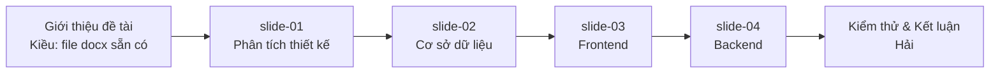

# Bộ tài liệu nâng cấp SLIDE — Web HotelBooking

Bộ file này được viết riêng để **paste thẳng vào slide bảo vệ đồ án** — mỗi mục có bảng, sơ đồ Mermaid, và câu hỏi phản biện gợi ý.

## Mục lục

| # | File | Nội dung chính | Phục vụ sinh viên (theo bảng phân công) |
|---|------|---------------|------------------------------------------|
| 01 | [slide-01-phan-tich-thiet-ke.md](slide-01-phan-tich-thiet-ke.md) | Use Case Diagram · Activity Diagram (5 luồng) · Sequence Diagram · State Diagram · Component Diagram | Nguyễn Ngọc Kiều (K25DTCN195) — Phân tích thiết kế hệ thống |
| 02 | [slide-02-co-so-du-lieu.md](slide-02-co-so-du-lieu.md) | ERD Mermaid · Mô tả chi tiết 7 bảng (Users, Hotels, Rooms, Bookings, Feedbacks, AuditLogs, SystemSettings) · Enum · Index · Seed | Nguyễn Minh Thi (K25DTCN332) — Cơ sở dữ liệu & Kết quả cài đặt |
| 03 | [slide-03-frontend.md](slide-03-frontend.md) | Cấu trúc thư mục · Routing map · AuthContext/ThemeContext · Axios interceptor · Mô tả từng page (customer + admin) · Design system Tailwind | Nguyễn Minh Thi — Lập trình frontend (ReactJS + UI/UX) |
| 04 | [slide-04-backend.md](slide-04-backend.md) | 3-layer architecture · Bảng đầy đủ 34 API endpoints · Middleware · Luồng nghiệp vụ trọng yếu · EmailService · Bảo mật · Deployment | Nguyễn Minh Thi — Lập trình backend (Node.js/Express) |

## Cách sử dụng khi làm slide

1. **Diagram Mermaid**: paste vào <https://mermaid.live> để chỉnh sửa hoặc export PNG. Hoặc dùng PowerPoint Add-in "Mermaid Chart" để render inline.
2. **Bảng Markdown**: copy trực tiếp — hầu hết editor slide (PowerPoint 365, Keynote, Google Slides) đều tự parse thành bảng khi paste.
3. **Nội dung dài**: tách 1 file thành 3-5 slide, không dồn hết vào 1 slide.
4. **Câu hỏi phản biện**: học kỹ mục cuối mỗi file — đây là bảo hiểm khi bị hội đồng vặn.

## Đính chính so với bảng phân công ban đầu

- Bảng phân công của Nguyễn Minh Thi ghi "schema **MySQL**" nhưng dự án thực tế đang chạy **Microsoft SQL Server** (xem `backend/config/db.js` dùng package `mssql`, cú pháp `NVARCHAR(MAX)`, `IDENTITY(1,1)`, `IF OBJECT_ID(...) IS NULL`). Khi trình bày cần **đọc là "SQL Server"** để đồng bộ với code demo — nếu để "MySQL" trong slide sẽ bị vặn.

## Bộ docs phản biện chi tiết (không phải slide)

Nếu muốn học kỹ để trả lời phản biện, đọc thêm 7 file dài trong thư mục cha:
- [`../00-tong-quan-kien-truc.md`](../00-tong-quan-kien-truc.md)
- [`../01-backend-xac-thuc-nguoi-dung.md`](../01-backend-xac-thuc-nguoi-dung.md)
- [`../02-backend-khach-san-phong.md`](../02-backend-khach-san-phong.md)
- [`../03-backend-dat-phong-danh-gia.md`](../03-backend-dat-phong-danh-gia.md)
- [`../04-backend-quan-tri-admin.md`](../04-backend-quan-tri-admin.md)
- [`../05-co-so-du-lieu-va-dich-vu.md`](../05-co-so-du-lieu-va-dich-vu.md)
- [`../06-frontend-thanh-phan-dung-chung.md`](../06-frontend-thanh-phan-dung-chung.md)

## Bản đồ 4 file → thứ tự trình bày đề xuất

