# Slide 01 — Phân tích & Thiết kế hệ thống

> **Phục vụ mục:** Phân tích thiết kế hệ thống (Nguyễn Ngọc Kiều — K25DTCN195)
> **Nội dung:** Use Case Diagram, Activity Diagram, Sequence Diagram cho các luồng chính của Hotel Booking System.
> **Cách dùng:** Copy từng khối Mermaid vào PowerPoint (add-in "Mermaid Chart"), Notion, Draw.io hoặc dán trực tiếp vào GitHub/README để render sẵn. Nếu công cụ không hỗ trợ Mermaid, có thể export sang PNG tại <https://mermaid.live>.

---

## 1. Danh sách Actors (tác nhân)

| # | Actor | Mô tả | Cách phân biệt trong code |
|---|-------|-------|--------------------------|
| 1 | **Khách vãng lai (Guest)** | Người dùng chưa đăng nhập, có thể tìm/xem khách sạn và đặt phòng không cần tài khoản | `req.user = null` (thông qua middleware `optionalToken`) |
| 2 | **Khách hàng (Customer)** | Người dùng đã đăng ký & đăng nhập, có lịch sử đặt phòng | `role = 'customer'` trong bảng `Users` |
| 3 | **Quản lý (Manager)** | Quản lý dữ liệu khách sạn/phòng/booking nhưng KHÔNG được thao tác trên tài khoản người dùng | `role = 'manager'` |
| 4 | **Quản trị viên (Admin)** | Toàn quyền trên hệ thống, kể cả CRUD tài khoản, cấu hình email | `role = 'admin'` |
| 5 | **Hệ thống Email (SMTP/Mock)** | Gửi email xác nhận đăng ký & xác nhận đặt phòng | `services/emailService.js` (Nodemailer) |

---

## 2. Use Case Diagram

Sơ đồ dưới đây thể hiện các use case chính, thứ tự tính kế thừa: Admin ⊃ Manager ⊃ Customer ⊃ Guest.

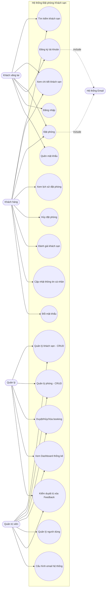

### 2.1. Mô tả chi tiết các use case chính (ưu tiên UC quan trọng)

#### UC-03. Đặt phòng

| Mục | Nội dung |
|------|----------|
| **ID** | UC-03 |
| **Actor** | Guest, Customer |
| **Tiền điều kiện** | Đã chọn khách sạn, phòng, ngày check-in/check-out |
| **Luồng chính** | 1) Nhập/xác nhận thông tin liên hệ · 2) Chọn hình thức thanh toán (Pay at hotel / Mock card / Mock momo) · 3) Backend kiểm tra phòng còn trống · 4) Tính tổng tiền = `price_per_night × số đêm` · 5) Ghi bản ghi Booking (status = `pending`, payment_status = `unpaid` hoặc `paid`) · 6) Gửi email xác nhận |
| **Luồng phụ (Exception)** | E1: Phòng đã hết → báo lỗi 400 · E2: Ngày check-in ≥ check-out → báo lỗi 400 · E3: Số khách vượt `max_guests` → báo lỗi 400 · E4: Guest không cung cấp email/tên → báo lỗi 400 |
| **Hậu điều kiện** | Có 1 bản ghi mới trong bảng `Bookings`; ghi log audit; email đã được đẩy qua SMTP hoặc mock |
| **File liên quan** | `backend/controllers/bookingController.js` (`createBooking`), `backend/utils/availability.js` (`getBookedRoomCountMap`) |

#### UC-05. Đăng nhập

| Mục | Nội dung |
|------|----------|
| **ID** | UC-05 |
| **Actor** | Guest → trở thành Customer/Manager/Admin |
| **Luồng chính** | 1) Người dùng nhập email + password · 2) BE kiểm tra email tồn tại · 3) So sánh `bcrypt.compare(password, password_hash)` · 4) Sinh access-token JWT (7 ngày) + refresh-token (opaque, 30 ngày, hash SHA-256 lưu DB) · 5) Reset `failed_attempts = 0`, cập nhật `last_login`, ghi audit log |
| **Luồng phụ** | E1: Email không tồn tại → 400 · E2: Sai mật khẩu → `failed_attempts++`, nếu ≥5 khóa tài khoản (status = `locked`) · E3: Tài khoản bị disable → 403 |
| **Hậu điều kiện** | Frontend lưu token + user vào `localStorage`, redirect về trang chủ hoặc trang trước |
| **File liên quan** | `backend/controllers/authController.js` (`login`), `frontend/src/pages/Login.js` |

#### UC-07. Hủy đặt phòng

| Mục | Nội dung |
|------|----------|
| **ID** | UC-07 |
| **Actor** | Customer |
| **Tiền điều kiện** | Đang đăng nhập, booking thuộc chính user, status ≠ `cancelled` |
| **Luồng chính** | 1) Chọn booking trong "My Bookings" · 2) Bấm Hủy · 3) BE kiểm tra `check_in > current_date` · 4) Cập nhật `status = 'cancelled'`; nếu đã `paid` → `payment_status = 'refunded'` |
| **Luồng phụ** | E1: Đã qua ngày nhận phòng → 400 "Chỉ có thể hủy trước ngày nhận phòng" · E2: Đã hủy trước đó → 400 |

#### UC-14. Duyệt/Hủy/Xóa booking (Admin)

| Mục | Nội dung |
|------|----------|
| **ID** | UC-14 |
| **Actor** | Admin, Manager |
| **Luồng chính** | 1) Vào `/admin/bookings` xem toàn bộ danh sách · 2) Đổi trạng thái sang `confirmed` / `cancelled` · 3) Nếu status → cancelled và đã paid → auto set `refunded` · 4) Có thể xóa vĩnh viễn |
| **File liên quan** | `backend/controllers/bookingController.js` (`getAllBookings`, `updateBookingStatus`, `deleteBooking`) |

---

## 3. Activity Diagrams

### 3.1. Luồng "Đăng ký tài khoản"

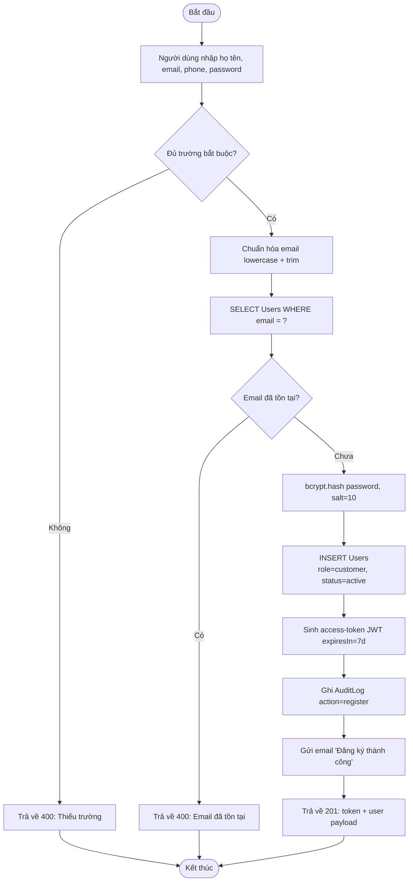

### 3.2. Luồng "Đăng nhập & khóa tài khoản"

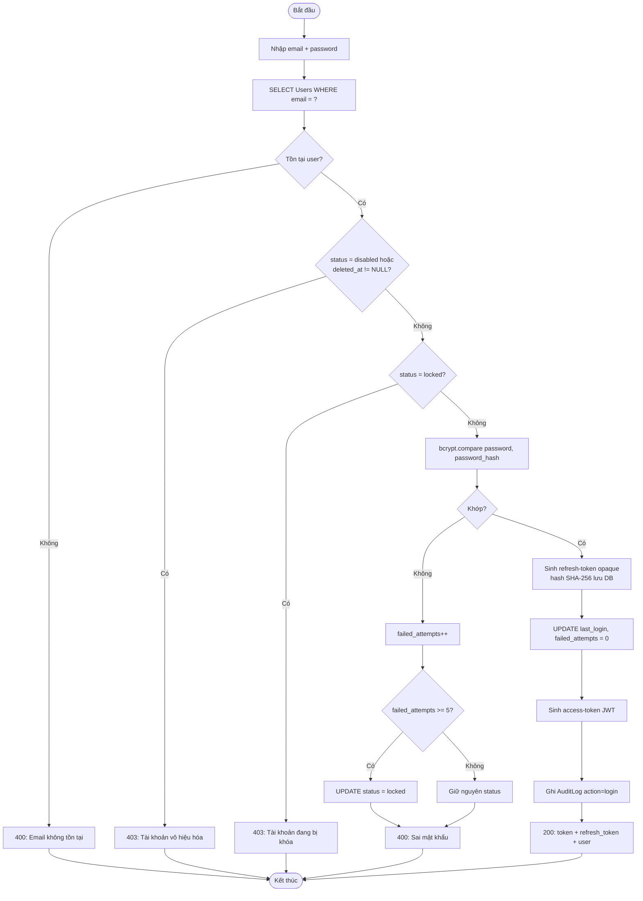

### 3.3. Luồng "Đặt phòng" (bao gồm nhánh Guest & User)

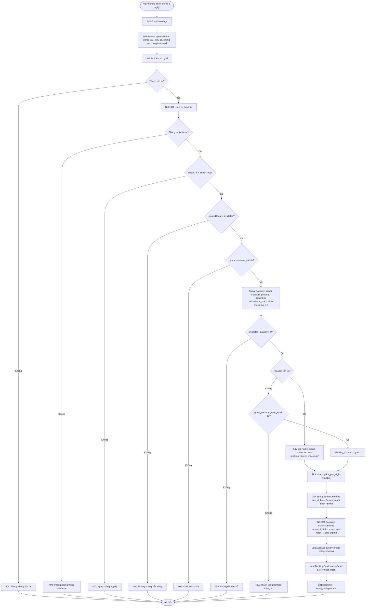

**Điểm quan trọng cần nhấn khi bảo vệ:**

- Backend cho phép **Guest booking** (không token) — dùng middleware `optionalToken`, cột `booking_source` phân biệt (`account` vs `guest`).
- Kiểm tra phòng trống dùng công thức: `total_quantity - COUNT(bookings status IN pending/confirmed AND overlap dates) > 0`.
- **Race condition tiềm ẩn:** giữa bước "kiểm tra còn trống" và bước "INSERT" không có transaction/lock ⇒ 2 người có thể đặt trùng cùng lúc. Đây là điểm yếu cần nêu (đã note trong `docs/README.md`).

### 3.4. Luồng "Hủy đặt phòng"

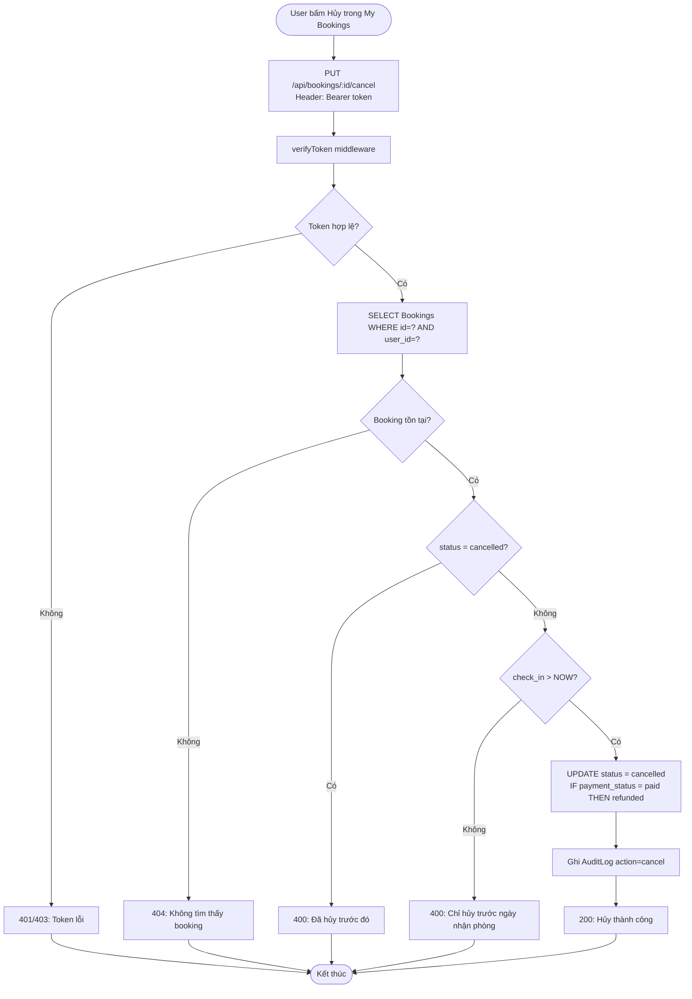

### 3.5. Luồng "Đánh giá khách sạn" (Feedback)

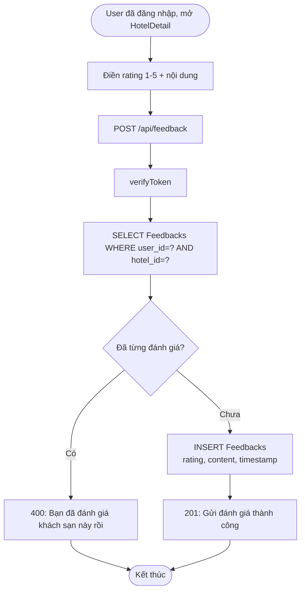

> **Nhược điểm cần biết:** BE hiện KHÔNG kiểm tra user đã từng đặt phòng thành công tại hotel này trước khi cho feedback. Ràng buộc duy nhất là **1 user ↔ 1 hotel = 1 feedback** (nhờ `UQ_Feedbacks_UserHotel`).

### 3.6. Luồng "Admin duyệt Booking"

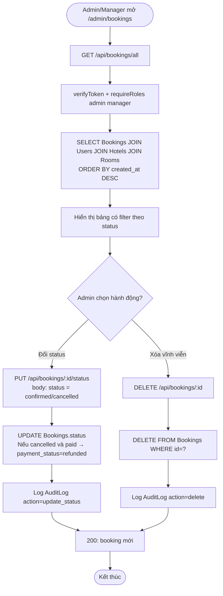

---

## 4. Sequence Diagrams (tương tác giữa các thành phần)

### 4.1. Sequence — Đặt phòng thành công (Customer)

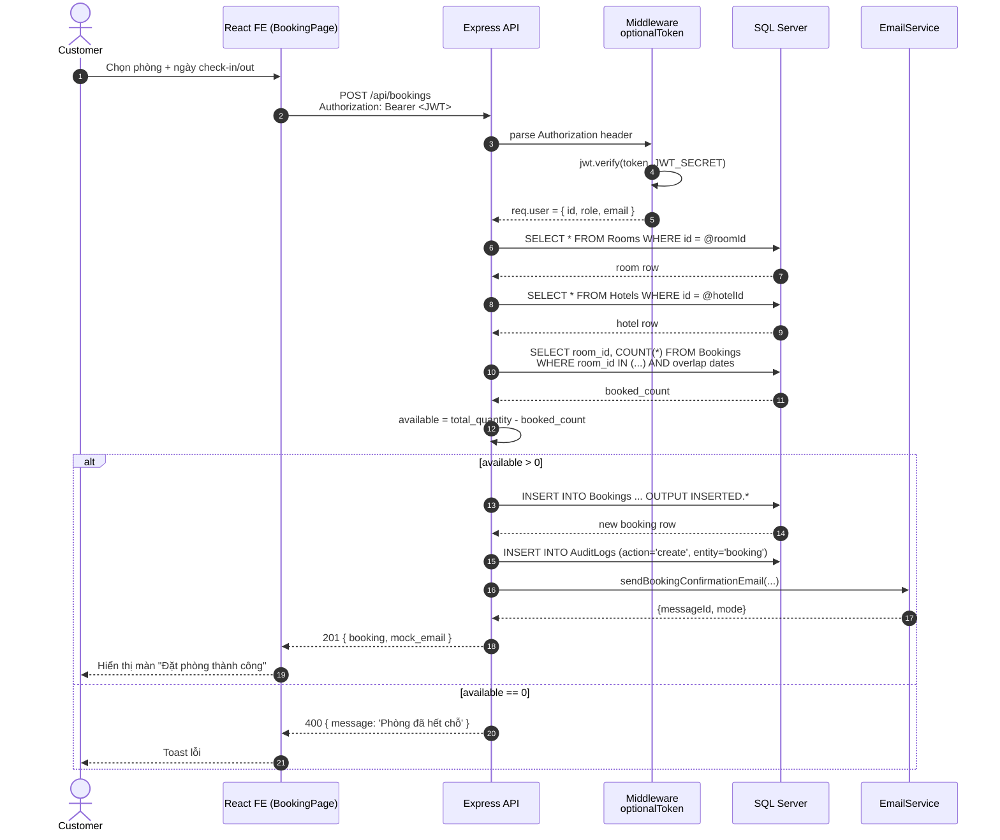

### 4.2. Sequence — Refresh Access Token

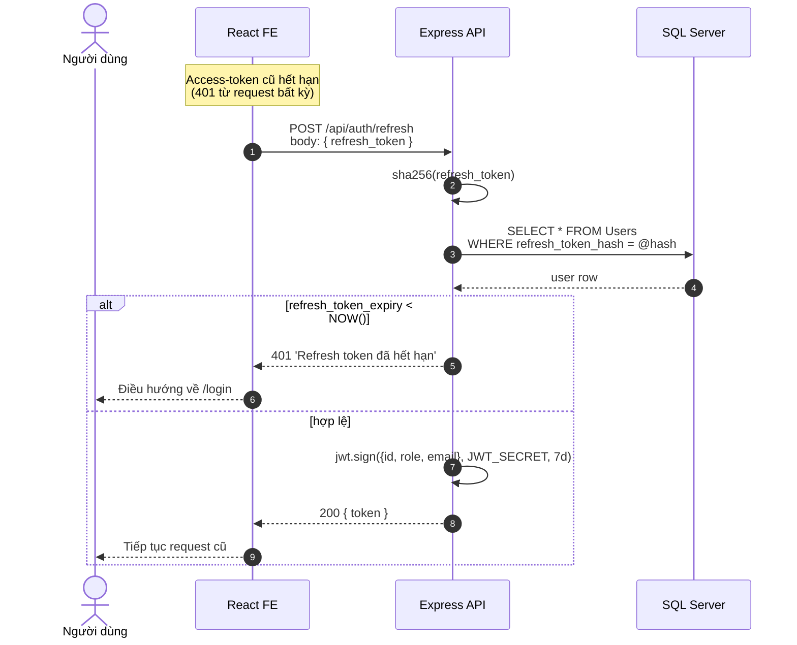

---

## 5. State Diagram — Vòng đời của một Booking

Booking chạy qua các trạng thái sau, thể hiện trong cột `status` và `payment_status`:

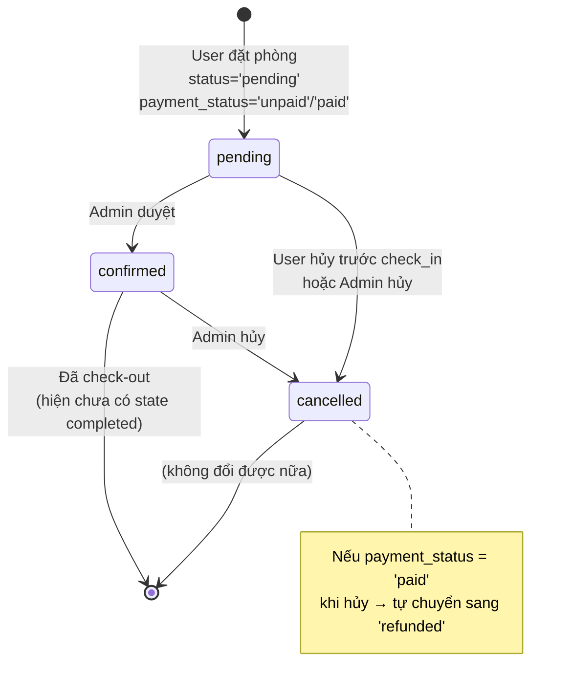

> **Gợi ý mở rộng:** hệ thống hiện chưa có trạng thái `completed` (check-out xong). Có thể bổ sung để tính doanh thu chính xác hơn (hiện tại doanh thu = tổng `confirmed` + đã paid).

---

## 6. Component Diagram (kiến trúc tổng thể)

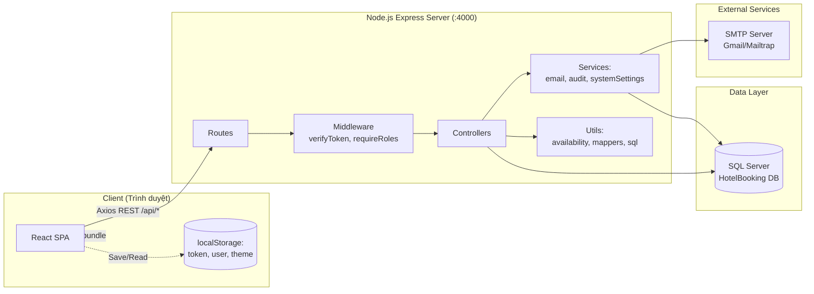

---

## 7. Ghi chú khi làm slide

- **Số lượng slide đề xuất:** 6 slide (mỗi phần từ 2→6 là 1 slide).
- **Bản in mờ (backup):** giữ file `.md` này ở phần Phụ lục, đề phòng máy chiếu không hiện Mermaid → dùng ảnh PNG đã export sẵn.
- **Câu hỏi phản biện thường gặp:**
  1. *"Tại sao Guest booking lại được thiết kế cùng flow với User?"* → Vì trải nghiệm giảm ma sát, giảm bounce; điểm khác biệt chỉ ở `booking_source` và bộ thông tin liên hệ.
  2. *"Race condition khi đặt phòng đồng thời xử lý ra sao?"* → Trung thực nêu điểm yếu, hướng khắc phục là dùng `HOLDLOCK, UPDLOCK, ROWLOCK` hoặc `SERIALIZABLE isolation` trong transaction.
  3. *"Vì sao dùng cả JWT (access) và opaque token (refresh)?"* → JWT stateless để verify nhanh, refresh-token opaque + hash trong DB để có thể revoke khi cần.
