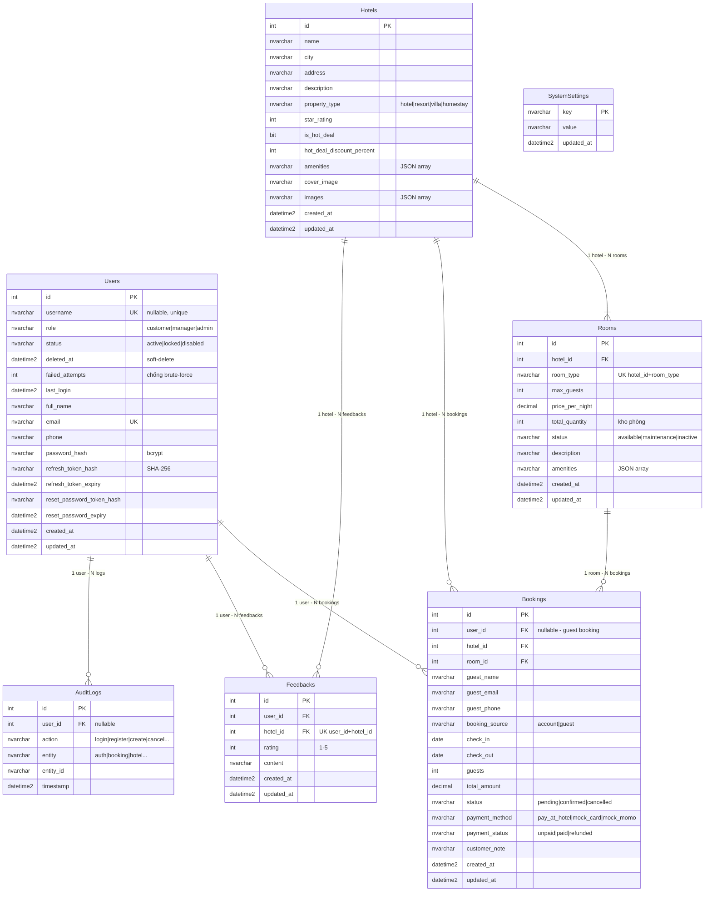
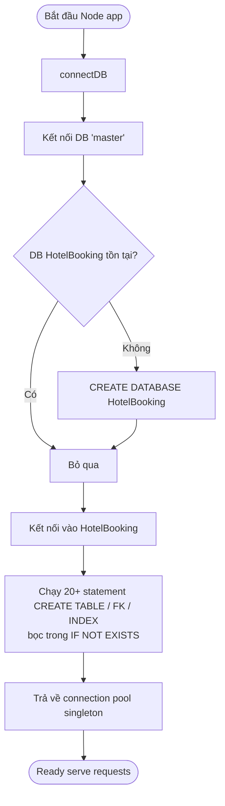

# Slide 02 — Cơ sở dữ liệu (SQL Server)

> **Phục vụ mục:** Cơ sở dữ liệu & Kết quả cài đặt (Nguyễn Minh Thi — K25DTCN332)
> **DBMS đang dùng:** **Microsoft SQL Server** (schema định nghĩa tại `backend/config/db.js`, script snapshot tại `database/hotel_booking_full.sql`).
> **Cách nạp DB:** hoặc chạy `npm run seed` (Node), hoặc import file `database/hotel_booking_full.sql` vào SSMS.

> ⚠️ **Đính chính so với bảng phân công ban đầu:** ghi "schema MySQL" là chưa chính xác — code thực tế đang dùng **SQL Server (MSSQL)** với các cú pháp đặc thù `NVARCHAR(MAX)`, `DATETIME2`, `IDENTITY(1,1)`, `IF OBJECT_ID(...) IS NULL`. Khi trình chiếu nên nói "SQL Server" để khớp với demo.

---

## 1. ERD — Sơ đồ quan hệ thực thể



### Tổng quan quan hệ

| Quan hệ | Loại | Ràng buộc | Ghi chú |
|---------|------|-----------|---------|
| Hotels → Rooms | 1 : N | `ON DELETE CASCADE` | Xóa khách sạn tự xóa phòng |
| Hotels → Bookings | 1 : N | `ON DELETE CASCADE` | Xóa khách sạn xóa cả booking (nên cân nhắc) |
| Hotels → Feedbacks | 1 : N | `ON DELETE CASCADE` | |
| Rooms → Bookings | 1 : N | `ON DELETE NO ACTION` | Chặn xóa nếu còn booking; `deleteRoom` xử lý bằng transaction xóa booking trước |
| Users → Bookings | 1 : N (nullable) | `ON DELETE SET NULL` | Xóa user thì booking cũ vẫn tồn tại (chuyển thành ẩn danh) |
| Users → Feedbacks | 1 : N | `ON DELETE CASCADE` | Xóa user thì feedback biến mất |
| Users → AuditLogs | 1 : N (nullable) | `ON DELETE SET NULL` | Giữ log để audit dù user bị xóa |

---

## 2. Mô tả chi tiết từng bảng

### 2.1. Bảng `Users` — Người dùng hệ thống

| Cột | Kiểu | Ràng buộc | Ý nghĩa |
|-----|------|-----------|---------|
| `id` | `INT IDENTITY(1,1)` | PRIMARY KEY | Khóa chính auto-increment |
| `username` | `NVARCHAR(100)` | NULL, UNIQUE INDEX với filter `WHERE username IS NOT NULL` | Tên đăng nhập tùy chọn; customer có thể `NULL` |
| `role` | `NVARCHAR(20)` | NOT NULL, DEFAULT `'customer'` | Enum: `customer`, `manager`, `admin`, `staff` |
| `status` | `NVARCHAR(20)` | NOT NULL, DEFAULT `'active'` | Enum: `active`, `locked`, `disabled` |
| `deleted_at` | `DATETIME2` | NULL | Soft-delete; `NULL` = còn active |
| `failed_attempts` | `INT` | NOT NULL, DEFAULT 0 | Đếm số lần đăng nhập sai liên tiếp, reset về 0 sau khi login đúng |
| `last_login` | `DATETIME2` | NULL | Timestamp lần đăng nhập gần nhất |
| `full_name` | `NVARCHAR(150)` | NOT NULL | Họ tên hiển thị |
| `email` | `NVARCHAR(255)` | NOT NULL, UNIQUE | Định danh chính khi đăng nhập; lowercase |
| `phone` | `NVARCHAR(30)` | NOT NULL, DEFAULT `''` | Số điện thoại |
| `password_hash` | `NVARCHAR(255)` | NOT NULL | Bcrypt hash (salt rounds = 10) |
| `refresh_token_hash` | `NVARCHAR(255)` | NULL | SHA-256 của refresh token opaque, tránh lưu plain text |
| `refresh_token_expiry` | `DATETIME2` | NULL | Hết hạn refresh token (mặc định 30 ngày) |
| `reset_password_token_hash` | `NVARCHAR(255)` | NULL | Dùng cho luồng "Quên mật khẩu" |
| `reset_password_expiry` | `DATETIME2` | NULL | Hết hạn token reset (mặc định 30 phút) |
| `created_at` / `updated_at` | `DATETIME2` | NOT NULL, DEFAULT `SYSUTCDATETIME()` | Audit thời gian |

**Index đặc biệt:**
- `UQ_Users_Email` — UNIQUE trên `email`.
- `UQ_Users_Username` — UNIQUE **có filter** `WHERE username IS NOT NULL` (phép nhiều user có username = NULL).

**Ràng buộc nghiệp vụ tại tầng ứng dụng:**
- `failed_attempts >= 5` → tự động set `status = 'locked'`.
- Sau khi đổi mật khẩu → invalidate toàn bộ refresh/reset token.

---

### 2.2. Bảng `Hotels` — Khách sạn

| Cột | Kiểu | Ràng buộc | Ý nghĩa |
|-----|------|-----------|---------|
| `id` | `INT IDENTITY(1,1)` | PK | |
| `name` | `NVARCHAR(200)` | NOT NULL | Tên khách sạn |
| `city` | `NVARCHAR(120)` | NOT NULL | Thành phố (dữ liệu ASCII: `Ho Chi Minh`, `Ha Noi`, `Da Nang`…). Backend có `CITY_ALIAS_MAP` chuyển "sài gòn"/"tphcm" → `Ho Chi Minh` |
| `address` | `NVARCHAR(255)` | | Địa chỉ chi tiết |
| `description` | `NVARCHAR(MAX)` | | Mô tả dài |
| `property_type` | `NVARCHAR(30)` | DEFAULT `'hotel'` | Enum: `hotel`, `resort`, `villa`, `homestay` |
| `star_rating` | `INT` | DEFAULT 0 | Số sao chính thức (0-5) |
| `is_hot_deal` | `BIT` | DEFAULT 0 | Cờ khuyến mãi |
| `hot_deal_discount_percent` | `INT` | DEFAULT 0 | Mức giảm giá (0-100) |
| `amenities` | `NVARCHAR(MAX)` | DEFAULT `'[]'` | **JSON array** dạng string: `["WiFi","Pool","Gym"]` |
| `cover_image` | `NVARCHAR(MAX)` | | URL ảnh bìa |
| `images` | `NVARCHAR(MAX)` | DEFAULT `'[]'` | JSON array các URL ảnh gallery |
| `created_at` / `updated_at` | `DATETIME2` | | |

**Lưu ý thiết kế:**
- Lưu `amenities` dưới dạng JSON string trong 1 cột (denormalized) → truy vấn "lọc theo amenity" hiện đang thực hiện ở tầng JavaScript, không phải WHERE trong SQL. Điểm này KHÔNG scale tốt với dữ liệu lớn.
- Không có `average_rating` cache → mỗi lần hiển thị phải tính từ bảng `Feedbacks`.

---

### 2.3. Bảng `Rooms` — Loại phòng

| Cột | Kiểu | Ràng buộc | Ý nghĩa |
|-----|------|-----------|---------|
| `id` | `INT IDENTITY(1,1)` | PK | |
| `hotel_id` | `INT` | FK → `Hotels.id`, ON DELETE CASCADE | |
| `room_type` | `NVARCHAR(150)` | NOT NULL | "Deluxe", "Suite"… Kết hợp với `hotel_id` tạo UNIQUE |
| `max_guests` | `INT` | DEFAULT 2 | Sức chứa tối đa |
| `price_per_night` | `DECIMAL(18,2)` | NOT NULL | Giá 1 đêm (VNĐ) |
| `total_quantity` | `INT` | DEFAULT 1 | Số phòng cùng loại trong kho |
| `status` | `NVARCHAR(20)` | DEFAULT `'available'` | Enum: `available`, `maintenance`, `inactive` |
| `description` | `NVARCHAR(MAX)` | | Mô tả |
| `amenities` | `NVARCHAR(MAX)` | DEFAULT `'[]'` | JSON array tiện nghi phòng |

**Index:**
- `UQ_Rooms_HotelRoomType` — UNIQUE `(hotel_id, room_type)`: tránh 1 khách sạn có 2 loại phòng trùng tên.
- `IX_Rooms_HotelId` — index thường trên `hotel_id` để join nhanh.

**Business rule quan trọng:**
- Khái niệm "phòng còn trống" = `total_quantity - COUNT(bookings đang giữ chỗ trong khoảng ngày)`. Không phải mỗi phòng vật lý là 1 row; 1 row đại diện cho **1 loại phòng có N phòng vật lý**.

---

### 2.4. Bảng `Bookings` — Đơn đặt phòng

| Cột | Kiểu | Ràng buộc | Ý nghĩa |
|-----|------|-----------|---------|
| `id` | `INT IDENTITY(1,1)` | PK | |
| `user_id` | `INT` | FK → `Users.id`, ON DELETE **SET NULL**, **nullable** | `NULL` = đơn của Guest |
| `hotel_id` | `INT` | FK → `Hotels.id`, ON DELETE CASCADE | |
| `room_id` | `INT` | FK → `Rooms.id`, ON DELETE NO ACTION | |
| `guest_name` | `NVARCHAR(150)` | | Tên người ở (bắt buộc với Guest) |
| `guest_email` | `NVARCHAR(255)` | | Email nhận confirmation |
| `guest_phone` | `NVARCHAR(30)` | | |
| `booking_source` | `NVARCHAR(20)` | DEFAULT `'account'` | Enum: `account`, `guest` |
| `check_in` | `DATE` | NOT NULL | Ngày nhận phòng |
| `check_out` | `DATE` | NOT NULL | Ngày trả phòng (phải > check_in) |
| `guests` | `INT` | DEFAULT 1 | Số khách |
| `total_amount` | `DECIMAL(18,2)` | DEFAULT 0 | `price_per_night × số đêm` |
| `status` | `NVARCHAR(20)` | DEFAULT `'pending'` | Enum: `pending`, `confirmed`, `cancelled` |
| `payment_method` | `NVARCHAR(30)` | DEFAULT `'pay_at_hotel'` | Enum: `pay_at_hotel`, `mock_card`, `mock_momo` |
| `payment_status` | `NVARCHAR(20)` | DEFAULT `'unpaid'` | Enum: `unpaid`, `paid`, `refunded` |
| `customer_note` | `NVARCHAR(MAX)` | | Ghi chú khách |

**Index tối ưu:**
- `IX_Bookings_RoomDateStatus` — `(room_id, check_in, check_out, status)`. Đây là **index quan trọng nhất**, phục vụ query kiểm tra phòng trống:
  ```sql
  SELECT room_id, COUNT(*)
  FROM Bookings
  WHERE status IN ('pending','confirmed')
    AND room_id IN (@r1, @r2, ...)
    AND check_in < @checkOut
    AND check_out > @checkIn
  GROUP BY room_id;
  ```
- `IX_Bookings_UserCreatedAt` — `(user_id, created_at DESC)`: hỗ trợ "My Bookings" sắp xếp mới nhất.

**Vòng đời (state):** xem State Diagram trong `slide-01`.

---

### 2.5. Bảng `Feedbacks` — Đánh giá khách sạn

| Cột | Kiểu | Ràng buộc | Ý nghĩa |
|-----|------|-----------|---------|
| `id` | `INT IDENTITY(1,1)` | PK | |
| `user_id` | `INT` | FK → `Users.id`, ON DELETE CASCADE, NOT NULL | Chỉ user đã đăng ký mới được đánh giá |
| `hotel_id` | `INT` | FK → `Hotels.id`, ON DELETE CASCADE, NOT NULL | |
| `rating` | `INT` | NOT NULL | 1-5 sao (validate ở tầng UI/BE) |
| `content` | `NVARCHAR(MAX)` | DEFAULT `''` | Nội dung |
| `created_at` / `updated_at` | `DATETIME2` | | |

**Index:**
- `UQ_Feedbacks_UserHotel` — UNIQUE `(user_id, hotel_id)`: mỗi user chỉ được đánh giá 1 khách sạn 1 lần.
- `IX_Feedbacks_HotelId` — index thường để lấy nhanh review theo khách sạn.

**Điểm yếu cần biết:** BE hiện KHÔNG kiểm tra user đã từng có booking `confirmed` trước khi cho đánh giá → có thể spam đánh giá nếu bypass được ràng buộc unique.

---

### 2.6. Bảng `AuditLogs` — Nhật ký hệ thống

| Cột | Kiểu | Ràng buộc | Ý nghĩa |
|-----|------|-----------|---------|
| `id` | `INT IDENTITY(1,1)` | PK | |
| `user_id` | `INT` | FK → `Users.id`, ON DELETE SET NULL, nullable | Ai thực hiện |
| `action` | `NVARCHAR(100)` | NOT NULL | `login`, `register`, `create`, `cancel`, `update_status`, `delete`… |
| `entity` | `NVARCHAR(50)` | NOT NULL | `auth`, `booking`, `hotel`, `room`, `user`, `feedback` |
| `entity_id` | `NVARCHAR(50)` | NULL | ID bản ghi bị tác động |
| `timestamp` | `DATETIME2` | DEFAULT `SYSUTCDATETIME()` | |

Sinh tự động từ `services/auditService.js`.

---

### 2.7. Bảng `SystemSettings` — Cấu hình động

| Cột | Kiểu | Ý nghĩa |
|-----|------|---------|
| `key` | `NVARCHAR(100)` PK | Khóa cấu hình. Hiện dùng `email_sender` |
| `value` | `NVARCHAR(MAX)` | Giá trị (dạng chuỗi, parse tùy loại) |
| `updated_at` | `DATETIME2` | |

Dùng để Admin đổi email gửi confirmation qua UI `/admin/system-settings` mà **không cần restart backend**.

---

## 3. Bảng tổng hợp Enum & giá trị hợp lệ

| Cột | Bảng | Giá trị hợp lệ |
|-----|------|----------------|
| `role` | Users | `customer`, `manager`, `admin`, `staff` |
| `status` | Users | `active`, `locked`, `disabled` |
| `property_type` | Hotels | `hotel`, `resort`, `villa`, `homestay` |
| `status` | Rooms | `available`, `maintenance`, `inactive` |
| `booking_source` | Bookings | `account`, `guest` |
| `status` | Bookings | `pending`, `confirmed`, `cancelled` |
| `payment_method` | Bookings | `pay_at_hotel`, `mock_card`, `mock_momo` |
| `payment_status` | Bookings | `unpaid`, `paid`, `refunded` |

> Enum được **cưỡng chế ở tầng ứng dụng (Node.js)**, không có `CHECK constraint` trong SQL Server — nếu insert trực tiếp bằng SSMS có thể ghi sai giá trị. Đây là điểm có thể siết chặt thêm bằng `CHECK (status IN ('pending','confirmed','cancelled'))`.

---

## 4. Các Index quan trọng và mục đích

| Index | Bảng | Cột | Mục đích |
|-------|------|-----|----------|
| `UQ_Users_Email` | Users | `email` | Đăng nhập, chống trùng email |
| `UQ_Users_Username` | Users | `username` (filter NOT NULL) | Cho phép nhiều user không có username |
| `UQ_Rooms_HotelRoomType` | Rooms | `(hotel_id, room_type)` | 1 khách sạn không có 2 loại phòng trùng tên |
| `IX_Rooms_HotelId` | Rooms | `hotel_id` | JOIN nhanh khi lấy phòng theo khách sạn |
| `IX_Bookings_RoomDateStatus` | Bookings | `(room_id, check_in, check_out, status)` | **Kiểm tra phòng trống** — query nóng nhất |
| `IX_Bookings_UserCreatedAt` | Bookings | `(user_id, created_at DESC)` | Trang "My Bookings" |
| `UQ_Feedbacks_UserHotel` | Feedbacks | `(user_id, hotel_id)` | 1 user - 1 khách sạn - 1 đánh giá |
| `IX_Feedbacks_HotelId` | Feedbacks | `hotel_id` | Đọc review theo khách sạn |

---

## 5. Dữ liệu mẫu (Seed) — thống kê

Chạy `npm run seed` sẽ tạo bộ dữ liệu demo có ý nghĩa:

| Bảng | Số bản ghi | Ghi chú |
|------|------------|---------|
| Users | 89 | 1 admin + 1 manager + 2 customer chính + 80 customer bulk + 5 seed khác |
| Hotels | 51 | Rải đều 8 thành phố lớn |
| Rooms | 197 | ~3-5 loại phòng / khách sạn |
| Bookings | ~1.450 | Trải đều 2023 → hiện tại (~3,5 năm) để biểu đồ có xu hướng |
| Feedbacks | 162 | |
| SystemSettings | 1 | `email_sender` |

**Tài khoản demo tiêu biểu:**

| Vai trò | Email | Mật khẩu |
|---------|-------|----------|
| Admin | `admin@hotelbooking.local` | `123` |
| Manager | `manager@hotelbooking.local` | `Manager@123` |
| Customer | `lan@example.com` | `Customer@123` |
| Customer | `khoa@example.com` | `Customer@123` |
| Customer bulk | `demo.customer1@…` → `demo.customer80@…` | `Customer@123` |

---

## 6. Kịch bản khởi tạo Database



**Ưu điểm:**
- Khởi động lần đầu không cần chạy migration bằng tay.
- An toàn khi restart nhiều lần (idempotent nhờ `IF OBJECT_ID(...) IS NULL`).

**Nhược điểm cần nêu khi phản biện:**
- Đây KHÔNG phải công cụ migration chuẩn (Flyway/Knex/Prisma) — không có version history, không rollback được.
- Nếu thay đổi cấu trúc bảng đã tồn tại (thêm/xóa cột), phải viết `ALTER TABLE` bằng tay ngoài.

---

## 7. Câu hỏi phản biện thường gặp về DB

1. **Vì sao chọn SQL Server thay vì MySQL/PostgreSQL?**
   → SQL Server có bộ kiểu dữ liệu Unicode `NVARCHAR` tốt cho tiếng Việt, tools SSMS quen thuộc, đủ chuẩn ACID cho luồng đặt phòng. Nếu chuyển sang MySQL 8+ hoặc PostgreSQL cũng khả thi, chi phí chuyển ~1 tuần.

2. **Vì sao `amenities` lưu JSON string trong 1 cột thay vì tách bảng riêng?**
   → Ưu: đơn giản, đọc/ghi nhanh, không cần JOIN. Nhược: không lọc được ở tầng SQL. Với ~50 khách sạn thì lọc JS chấp nhận được, khi scale lên 10k+ khách sạn cần tách bảng `HotelAmenities`.

3. **Race condition khi 2 người đặt cùng 1 phòng cuối cùng?**
   → Có tồn tại: `getBookedRoomCountMap` và `INSERT INTO Bookings` KHÔNG nằm trong transaction/lock. Hướng khắc phục: bọc trong `withTransaction` với `SERIALIZABLE` isolation, hoặc dùng `SELECT … WITH (HOLDLOCK, UPDLOCK, ROWLOCK)`.

4. **Tại sao `user_id` trong Bookings là nullable?**
   → Hỗ trợ Guest Booking (đặt phòng không cần đăng ký). Trường `booking_source = 'guest'` giúp phân biệt.

5. **Tại sao dùng `SET NULL` cho `Bookings.user_id` khi user bị xóa?**
   → Bảo toàn dữ liệu doanh thu lịch sử. Nếu `CASCADE`, xóa 1 user sẽ mất toàn bộ booking → sai lệch báo cáo.

6. **Có kiểm tra ràng buộc `check_out > check_in` ở DB không?**
   → Chưa — hiện tại chỉ có ở tầng application (`normalizeDateRange`). Nên bổ sung `CHECK (check_out > check_in)` để phòng insert trực tiếp SQL.
