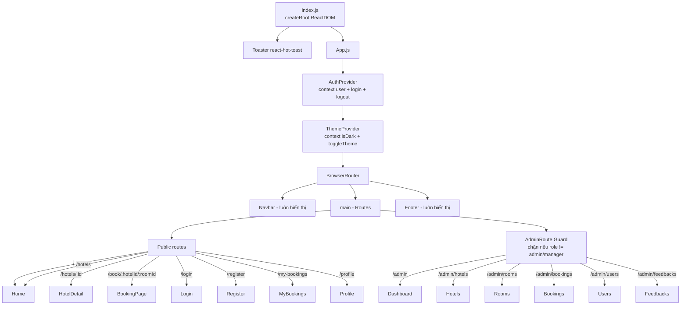
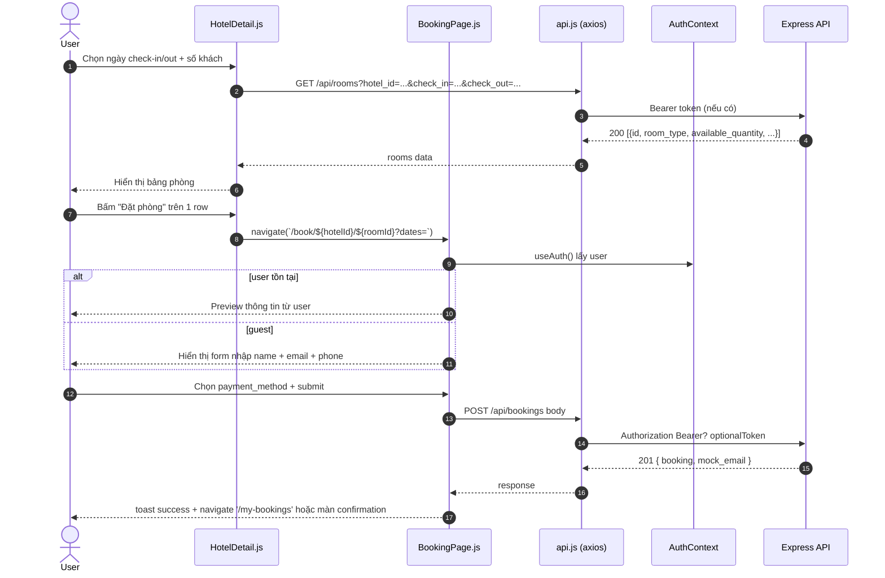

# Slide 03 — Frontend (React SPA)

> **Phục vụ mục:** Lập trình frontend & UI/UX (Nguyễn Minh Thi — K25DTCN332)
> **Stack:** React 19, React Router 7, Tailwind CSS 3, Axios 1, Recharts 3, React-Hot-Toast, React-Icons/Lucide.
> **Kiểu ứng dụng:** Single-Page Application (SPA), không SSR, không Next.js.
> **Cổng dev:** `http://localhost:3000` (frontend) → gọi API tại `http://localhost:4000/api`.

---

## 1. Cấu trúc thư mục

```text
frontend/my-hotel-app/
├── public/                    # Static (index.html, favicon)
├── tailwind.config.js         # Cấu hình theme, màu, breakpoint
├── postcss.config.js          # PostCSS + autoprefixer
├── package.json               # React 19, dependencies
└── src/
    ├── App.js                 # Entry điều phối route + Provider
    ├── index.js               # ReactDOM.createRoot + toast
    ├── index.css              # Tailwind base + biến CSS theme
    │
    ├── components/            # Component dùng chung
    │   ├── Navbar.js          # Thanh nav sticky, menu user, theme toggle
    │   ├── Footer.js          # Footer chân trang
    │   ├── AdminRoute.js      # Guard chặn user không phải admin
    │   ├── HeroSearchBar.js   # Ô tìm kiếm khách sạn ở trang chủ
    │   ├── HotelCardPremium.js# Thẻ hiển thị 1 khách sạn (grid)
    │   ├── HotelListingSection.js # Container render danh sách hotel
    │   └── SafeImage.js       #  có fallback nếu lỗi load
    │
    ├── context/               # React Context (state toàn cục)
    │   ├── AuthContext.js     # user + login + logout, gắn localStorage
    │   └── ThemeContext.js    # Sáng/Tối, lưu localStorage
    │
    ├── services/
    │   └── api.js             # Axios instance + interceptor JWT
    │
    ├── utils/
    │   ├── format.js          # Định dạng tiền, ngày
    │   ├── bookingStatus.js   # Map status → màu, text, icon
    │   └── cn.js              # Utility gộp className có điều kiện
    │
    └── pages/                 # Các trang (route level)
        ├── Home.js            # Trang chủ + danh sách khách sạn
        ├── HotelDetail.js     # Chi tiết + danh sách phòng + review
        ├── BookingPage.js     # Form đặt phòng
        ├── Login.js
        ├── Register.js
        ├── Profile.js         # Cập nhật thông tin + đổi mật khẩu
        ├── MyBookings.js      # Lịch sử booking + hủy phòng
        └── admin/             # Trang dành cho Admin/Manager
            ├── Dashboard.js   # Doanh thu, biểu đồ Recharts
            ├── Hotels.js      # CRUD khách sạn
            ├── Rooms.js       # CRUD phòng
            ├── Bookings.js    # Duyệt/Hủy/Xóa booking
            ├── Users.js       # Quản lý tài khoản
            └── Feedbacks.js   # Kiểm duyệt đánh giá
```

---

## 2. Sơ đồ điều phối Provider & Router



---

## 3. Bảng Routing đầy đủ

| # | Path | Component | Yêu cầu đăng nhập | Yêu cầu Role | Mô tả |
|---|------|-----------|-------------------|--------------|-------|
| 1 | `/` | `Home` | ❌ | – | Trang chủ + tìm kiếm nhanh + danh sách khách sạn |
| 2 | `/hotels` | `Home` | ❌ | – | Alias trang chủ (kích hoạt Guest mode banner) |
| 3 | `/hotels/:id` | `HotelDetail` | ❌ | – | Chi tiết khách sạn, gallery, phòng, review, Google Maps |
| 4 | `/book/:hotelId/:roomId` | `BookingPage` | ❌ (guest OK) | – | Form đặt phòng, chọn ngày, thanh toán |
| 5 | `/login` | `Login` | ❌ | – | Đăng nhập, lưu token vào localStorage |
| 6 | `/register` | `Register` | ❌ | – | Đăng ký + auto login |
| 7 | `/my-bookings` | `MyBookings` | ✅ | customer/admin/manager | Danh sách booking + nút Hủy |
| 8 | `/profile` | `Profile` | ✅ | any | Cập nhật thông tin cá nhân, đổi mật khẩu |
| 9 | `/admin` | `Dashboard` | ✅ | admin/manager | Doanh thu, biểu đồ, top hotel |
| 10 | `/admin/hotels` | `AdminHotels` | ✅ | admin/manager | CRUD khách sạn |
| 11 | `/admin/rooms` | `AdminRooms` | ✅ | admin/manager | CRUD phòng |
| 12 | `/admin/bookings` | `AdminBookings` | ✅ | admin/manager | Duyệt/Hủy/Xóa booking |
| 13 | `/admin/users` | `AdminUsers` | ✅ | admin | (Manager có thể xem, chỉ admin thao tác) |
| 14 | `/admin/feedbacks` | `AdminFeedbacks` | ✅ | admin/manager | Kiểm duyệt đánh giá |

> **Cơ chế bảo vệ route Admin:** dùng `<AdminRoute />` (component tại `components/AdminRoute.js`). Nếu `user = null` → redirect `/login`; nếu `user.role ∉ {admin, manager}` → redirect `/`. Đây là **bảo vệ tầng UI**; backend vẫn có `verifyToken + requireRoles` như là hàng phòng ngự thứ 2.

---

## 4. Quản lý State toàn cục

### 4.1. AuthContext

**File:** `src/context/AuthContext.js`

```jsx
{ user, login(userData, token), logout() }
```

- **Khởi tạo:** đọc `localStorage.getItem('user')` → `useState`. → Persistent qua reload.
- **`login(userData, token)`:** ghi `token` + `user` vào localStorage, `setUser(userData)`.
- **`logout()`:** xóa localStorage + reset context.
- **Hook tiện dụng:** `useAuth()` — dùng ở Navbar, Login, Register, MyBookings, AdminRoute.

**Điểm yếu cần nêu:** JWT lưu `localStorage` → có nguy cơ đánh cắp qua XSS. Best practice: httpOnly cookie. Trade-off: cookie phức tạp hơn khi frontend/backend khác domain.

### 4.2. ThemeContext

**File:** `src/context/ThemeContext.js`

```jsx
{ theme, isDark, setTheme, toggleTheme }
```

- **Khởi tạo:** đọc `localStorage['hotel-booking-theme']` (mặc định `light`).
- **`useEffect`:** toggle class `theme-dark` trên `<html>` và `<body>`, set `data-theme` — Tailwind + biến CSS trong `index.css` bắt để đổi màu.
- **Hook:** `useTheme()`, throw error nếu dùng ngoài Provider.

### 4.3. Bảng so sánh 2 context

| Tiêu chí | AuthContext | ThemeContext |
|----------|-------------|--------------|
| Persistent | `user`, `token` ↔ localStorage | `theme` ↔ localStorage |
| Trigger re-render | Login/logout | Toggle button |
| Được dùng ở | Navbar, AdminRoute, Login, Register, MyBookings, Profile… | Navbar (icon Sun/Moon), index.css biến |
| Có redirect | Không (component tự navigate) | Không |

---

## 5. Axios instance & Interceptor

**File:** `src/services/api.js`

```js
const api = axios.create({ baseURL: 'http://localhost:4000/api' });
```

### 5.1. Request Interceptor — auto gắn token

```js
api.interceptors.request.use((config) => {
  const token = localStorage.getItem('token');
  if (token) config.headers.Authorization = `Bearer ${token}`;
  return config;
});
```

→ Mọi request đều tự động có `Authorization: Bearer <JWT>` nếu user đã login.

### 5.2. Response Interceptor — bắt lỗi 401/403

```js
api.interceptors.response.use(res => res, error => {
  const status = error?.response?.status;
  const isAuthError = status === 401 || (status === 403 && authMessages.includes(message));
  if (isAuthError) {
    localStorage.removeItem('token');
    localStorage.removeItem('user');
    window.location.assign('/login');
  }
  return Promise.reject(error);
});
```

→ Token hết hạn / không hợp lệ → **tự động** dọn localStorage và redirect về `/login`, không cần code check ở mỗi component.

### 5.3. Điểm yếu cần biết

- `baseURL` hard-code `http://localhost:4000/api` → **KHÔNG hoạt động khi deploy** lên domain khác (Vercel, VPS). Cần đổi sang `process.env.REACT_APP_API_URL` với fallback localhost.
- Không có refresh-token flow tự động (mặc dù backend có API `/refresh`) → khi token 7 ngày hết hạn, user bị đá về login luôn thay vì được refresh silent.

---

## 6. Mô tả chi tiết các Page

### 6.1. `Home.js` (Trang chủ)

- **Hooks dùng:** `useState`, `useEffect`, `useSearchParams`, `useAuth`.
- **API call:** `GET /api/hotels` với query `city`, `check_in`, `check_out`, `guests`, `price_min`, `price_max`, `star_rating`, `amenities`.
- **UI:** Hero + `HeroSearchBar` → grid `HotelCardPremium`.
- **Đặc điểm:** Lọc theo tiện ích/giá/rating hiện thực hiện **ở tầng JavaScript client-side** trước khi render → không tối ưu khi có nhiều hotel.
- **Guest banner:** đọc `localStorage.isGuest` để hiển thị "Đang duyệt với vai trò khách vãng lai".

### 6.2. `HotelDetail.js`

- **Params:** `:id` từ URL.
- **API calls:**
  - `GET /api/hotels/:id` — thông tin khách sạn.
  - `GET /api/rooms?hotel_id=:id&check_in=&check_out=` — danh sách phòng có tính sẵn trạng thái `available/limited/full`.
  - `GET /api/feedback/:hotel_id` — reviews.
- **UI blocks:** ảnh gallery, thông tin cơ bản, bảng phòng (mỗi row có nút "Đặt phòng" → điều hướng `/book/:hotelId/:roomId`), khối reviews, **iframe Google Maps** nhúng theo địa chỉ.

### 6.3. `BookingPage.js`

- **Params:** `:hotelId`, `:roomId`.
- **Đặc biệt:** hoạt động cho **cả guest và user** — nếu `useAuth().user = null`, form yêu cầu điền `guest_name`, `guest_email`, `guest_phone`.
- **API call:** `POST /api/bookings` — response bao gồm `email_transport` (mock/smtp) + `mock_email` (nếu có).
- **Payment methods:** radio button 3 option — `pay_at_hotel` (mặc định), `mock_card`, `mock_momo`. Với 2 loại mock, `payment_status = 'paid'` ngay.

### 6.4. `Login.js` / `Register.js`

- **Login:** email + password → `POST /api/auth/login` → `login(user, token)` từ AuthContext → `navigate('/')`.
- **Register:** họ tên + email + phone + password → `POST /api/auth/register` → auto login (nhận `token` từ response luôn) → chào toast + `navigate('/')`.

### 6.5. `MyBookings.js`

- **API call:** `GET /api/bookings/my`.
- **UI:** danh sách card, mỗi card có badge trạng thái (dùng `getBookingStatusMeta` từ `utils/bookingStatus.js`) + nút "Hủy phòng" nếu `status = pending/confirmed` và `check_in > today`.
- **Action:** `PUT /api/bookings/:id/cancel`.

### 6.6. `Profile.js`

- **Form 1 — Thông tin cá nhân:** `PUT /api/auth/profile` (họ tên, phone). Sau khi cập nhật, ghi đè `user` trong AuthContext + localStorage.
- **Form 2 — Đổi mật khẩu:** `PUT /api/auth/change-password` (current_password, new_password). Sau khi đổi, refresh_token bị invalidate ở BE.

### 6.7. Các trang Admin

| Trang | API chính | UI đặc biệt |
|-------|-----------|-------------|
| `Dashboard.js` | `GET /api/admin/dashboard?from=&to=` | Biểu đồ đường (Recharts): doanh thu theo ngày/tháng/năm; Card KPI (doanh thu, số booking, tỷ lệ lấp đầy phòng); Top 5 hotel; bảng payment breakdown; cấu hình email sender qua `PUT /api/admin/system-settings` |
| `Hotels.js` | `GET/POST/PUT/DELETE /api/hotels` | Modal form CRUD với amenities dạng multi-tag, upload URL ảnh |
| `Rooms.js` | `GET /api/rooms?hotel_id=` + POST/PUT/DELETE | Select khách sạn trước, sau đó CRUD phòng |
| `Bookings.js` | `GET /api/bookings/all` + `PUT /:id/status`, `DELETE /:id` | Bảng filter theo status, dropdown đổi trạng thái, xóa cứng |
| `Users.js` | `GET/POST/PUT/PATCH /api/users` | Bảng list + modal edit; hành động lock/unlock (`/lock`, `/unlock`) — chỉ Admin |
| `Feedbacks.js` | `GET/DELETE /api/feedback` | Bảng review + nút xóa |

---

## 7. Component tái sử dụng

### 7.1. `HotelCardPremium.js`

- **Props:** `hotel` object (name, city, star_rating, price, images, is_hot_deal, hot_deal_discount_percent, amenities).
- **UI:** card 12px radius, hover shadow, badge "Hot Deal" nếu `is_hot_deal = true`, giá gạch bỏ + giá khuyến mãi bằng `price-accent` (#FF6B2C).

### 7.2. `HeroSearchBar.js`

- Ô nhập location + 2 date picker (check-in/check-out) + số khách → khi Submit `navigate('/hotels?' + params)`.
- Có logic **auto-suggest thành phố Việt Nam** (danh sách gợi ý cứng), người dùng gõ "sài gòn" cũng tra được vì backend có `CITY_ALIAS_MAP`.

### 7.3. `SafeImage.js`

- Wrap `` để nếu URL bị 404 → fallback về placeholder từ Unsplash. Tránh vỡ layout khi seed data có URL không tồn tại.

### 7.4. `AdminRoute.js`

Xem `slide-01`, mục 2 — đây là "guard component" dùng `<Outlet />` của React Router 7 để bọc toàn bộ nhóm route con.

### 7.5. Bảng meta trạng thái booking

Định nghĩa trong `utils/bookingStatus.js`:

| Status | Màu | Text (thường) | Text (decorated) |
|--------|-----|---------------|------------------|
| `pending` | `bg-yellow-100 text-yellow-700` | Chờ xác nhận | ⏳ Chờ xác nhận |
| `confirmed` | `bg-green-100 text-green-700` | Đã xác nhận | ✅ Đã xác nhận |
| `cancelled` | `bg-red-100 text-red-700` | Đã hủy | ❌ Đã hủy |

---

## 8. Design System — Tailwind config

**File:** `tailwind.config.js`

| Token | Giá trị | Áp dụng |
|-------|---------|---------|
| `primary` | `#0057FF` (xanh dương) | Nút chính, link, badge |
| `price-accent` | `#FF6B2C` (cam) | Giá tiền, hot deal |
| `sale-badge` | `#FF3B30` (đỏ) | Nhãn giảm giá mạnh |
| `star` | `#F59E0B` (vàng) | Icon sao đánh giá |
| Font | `Inter` | Toàn bộ UI |
| Border radius `card` | `12px` | HotelCardPremium |
| Border radius `hero` | `20px` | Hero SearchBar |
| Box shadow `card-hover` | `0 4px 16px rgba(0,0,0,0.10)` | Card hover |

**Dark mode:** dùng chiến lược **CSS variables + class-based** (không phải `dark:` class của Tailwind mặc định). Toggle bởi `ThemeContext` thông qua class `theme-dark` trên `<html>`.

### Biến CSS chính trong `index.css`

```css
:root { --color-surface: 255 255 255; --color-background: 249 250 251; --color-text-primary: 15 23 42; ... }
.theme-dark { --color-surface: 30 41 59; --color-background: 15 23 42; --color-text-primary: 241 245 249; ... }
```

---

## 9. Luồng dữ liệu mẫu — "User đặt phòng" từ FE



---

## 10. UI/UX Highlights (dùng khi thuyết trình)

1. **Guest booking** — không cần đăng ký vẫn đặt được → giảm ma sát, tăng conversion.
2. **Dark mode** — toggle mượt bằng CSS variables, ghi nhớ ở localStorage.
3. **Responsive** — Tailwind breakpoint `sm/md/lg` được dùng nhất quán, layout mobile-first.
4. **Real-time toast** — dùng `react-hot-toast` để feedback sau mọi hành động (login, đặt phòng, hủy, đổi mật khẩu).
5. **Empty state & loading state** — hầu hết trang có 3 state: loading spinner, empty (không có dữ liệu), error.
6. **Icon system** — react-icons/fa cho action, lucide-react cho icon minh họa hero.
7. **Ảnh fallback** — SafeImage tự động chuyển placeholder khi URL 404 → không vỡ layout.

---

## 11. Câu hỏi phản biện thường gặp về Frontend

1. **Tại sao chọn React chứ không Vue/Angular?**
   → React có hệ sinh thái lớn, react-router 7 hỗ trợ Outlet-based nested routing tốt, community lớn dễ tuyển & học. Vue ổn nhưng team đã quen React.

2. **Tại sao không dùng Next.js / SSR?**
   → Ứng dụng chủ yếu là dashboard + luồng đặt phòng, không cần SEO cho từng khách sạn. SPA đơn giản hơn, ship nhanh hơn. Nếu cần SEO → Next.js sau.

3. **Tại sao lưu JWT ở localStorage, không phải httpOnly cookie?**
   → Đơn giản khi cross-origin (FE:3000, BE:4000), không cần cấu hình CORS credentials. Trade-off: rủi ro XSS. Nếu deploy production, khuyên chuyển httpOnly cookie + CSRF token.

4. **Tại sao không có Redux/Zustand?**
   → State toàn cục ít, chỉ có auth + theme → Context đủ dùng, tránh phức tạp không cần thiết.

5. **Tại sao filter khách sạn lại ở tầng JavaScript client?**
   → Với dataset hiện tại (~50 hotel) thì đủ nhanh, code đơn giản. Đây là **điểm yếu công nhận trong docs/README.md** — khi scale lên hàng nghìn hotel, phải chuyển filter vào SQL WHERE.
