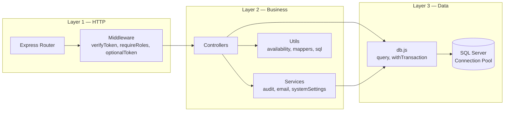
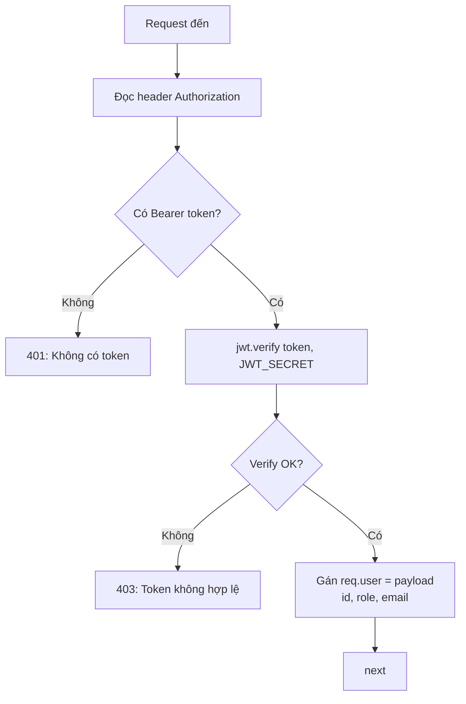
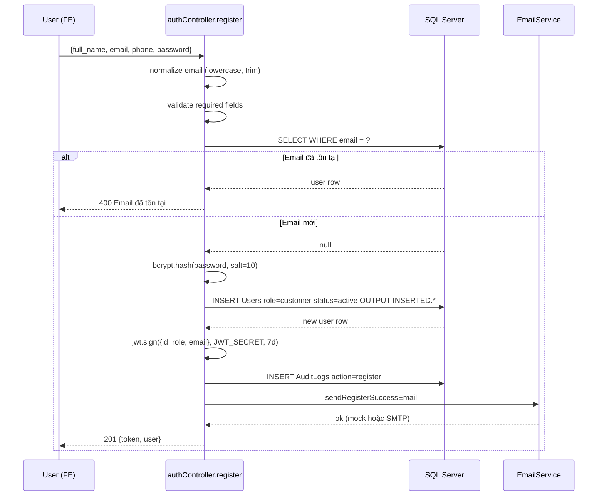
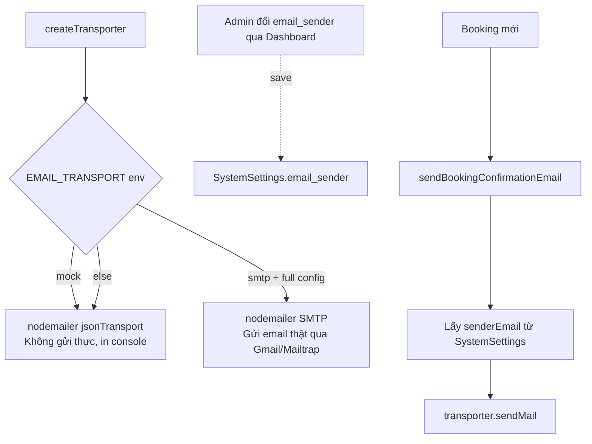
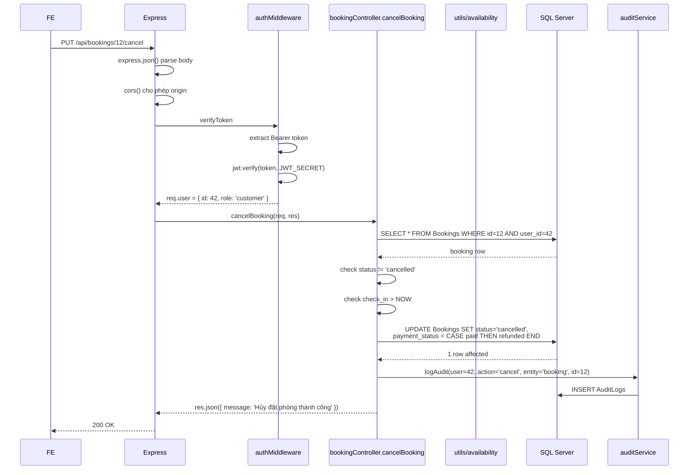

# Slide 04 — Backend (Node.js + Express + SQL Server)

> **Phục vụ mục:** Lập trình backend (Nguyễn Minh Thi — K25DTCN332); đối chiếu với Phân tích thiết kế (Kiều) & Kiểm thử/Triển khai (Hải)
> **Stack:** Node.js 18+, Express 5, `mssql` 12, `jsonwebtoken` 9, `bcryptjs` 3, `nodemailer` 8, `cors`, `dotenv`.
> **Cổng mặc định:** `:4000`. Toàn bộ API prefix `/api`.

---

## 1. Cấu trúc thư mục backend

```text
backend/
├── server.js                  # Entry point — Express bootstrap
├── seed.js                    # Script sinh dữ liệu demo (89 users, 51 hotel...)
├── reset-db.js                # Xóa toàn bộ dữ liệu (giữ schema)
├── .env                       # Cấu hình DB, JWT, SMTP
│
├── config/
│   └── db.js                  # Kết nối SQL Server, connection pool,
│                              # ensureDatabaseAndSchema, withTransaction, query
│
├── middleware/
│   └── authMiddleware.js      # verifyToken, optionalToken, requireRoles, isAdmin
│
├── routes/                    # Chỉ khai báo path + gắn middleware + controller
│   ├── authRoutes.js          # /api/auth/*
│   ├── userRoutes.js          # /api/users/*
│   ├── hotelRoutes.js         # /api/hotels/*
│   ├── roomRoutes.js          # /api/rooms/*
│   ├── bookingRoutes.js       # /api/bookings/*
│   ├── feedbackRoutes.js      # /api/feedback/*
│   └── adminRoutes.js         # /api/admin/*
│
├── controllers/               # Business logic + validate + gọi DB
│   ├── authController.js      # register, login, refresh, forgot/reset password, profile
│   ├── userController.js      # CRUD users (Admin)
│   ├── hotelController.js     # search filter, getHotelById, CRUD hotel
│   ├── roomController.js      # getRoomsByHotel, CRUD room
│   ├── bookingController.js   # createBooking, cancel, admin list, updateStatus
│   ├── feedbackController.js  # createFeedback, listFeedbacks, deleteFeedback
│   └── adminController.js     # getDashboardStats, systemSettings
│
├── services/                  # Business dịch vụ tách khỏi controller
│   ├── auditService.js        # logAudit(userId, action, entity, entityId)
│   ├── emailService.js        # Nodemailer SMTP + mock mode
│   └── systemSettingsService.js # Get/Upsert cấu hình động
│
├── utils/                     # Hàm dùng chung, không có state
│   ├── availability.js        # Tính phòng trống, overlap ngày
│   ├── mappers.js             # DB row → API response object
│   └── sql.js                 # buildInClause, parseJsonArray, toNumber/Boolean
│
└── scripts/
    └── export-sql-dump.js     # Xuất DB hiện tại thành hotel_booking_full.sql
```

---

## 2. Kiến trúc phân lớp (3 layers)



**Nguyên tắc chia lớp:**

- **Route**: chỉ định nghĩa `method + path + middleware + controller function` — KHÔNG có logic nghiệp vụ.
- **Middleware**: parse token, check role. Nếu fail → return sớm, không cho vào controller.
- **Controller**: nhận `req`/`res`, validate input, orchestrate services/utils/db, trả JSON.
- **Service**: nghiệp vụ độc lập với HTTP (audit log, gửi email, đọc setting) — có thể tái sử dụng.
- **Utils**: hàm thuần (pure function), không phụ thuộc DB (trừ `availability.js` có 1 query).
- **db.js**: quản lý pool, `query()`, `withTransaction()` — mọi truy vấn phải đi qua đây.

---

## 3. Bảng đầy đủ API Endpoints

**Convention:**
- 🔓 = public (không cần token)
- 🔑 = cần `verifyToken` (đăng nhập)
- 👑 = cần `requireRoles(['admin', 'manager'])`
- 🎖️ = cần `requireRoles(['admin'])` (chỉ admin)
- 🔓+ = `optionalToken` (có token thì parse, không có vẫn cho qua)

### 3.1. `/api/auth/*` — Xác thực

| Method | Path | Auth | Mô tả | Request body | Response 200/201 |
|--------|------|------|-------|--------------|------------------|
| POST | `/register` | 🔓 | Đăng ký customer mới | `{full_name, email, phone, password}` | `{token, user}` |
| POST | `/login` | 🔓 | Đăng nhập | `{email, password}` | `{token, refresh_token, user}` |
| POST | `/refresh` | 🔓 | Cấp lại access-token | `{refresh_token}` | `{token}` |
| POST | `/forgot-password` | 🔓 | Tạo token reset | `{email}` | `{message, reset_token?}` |
| POST | `/reset-password` | 🔓 | Đặt mật khẩu mới bằng token | `{token, new_password}` | `{message}` |
| PUT | `/profile` | 🔑 | Cập nhật họ tên/phone | `{full_name, phone}` | `{message, user}` |
| PUT | `/change-password` | 🔑 | Đổi password khi đã login | `{current_password, new_password}` | `{message}` |

### 3.2. `/api/users/*` — Quản lý user (Admin only)

| Method | Path | Auth | Mô tả |
|--------|------|------|-------|
| GET | `/` | 👑 | Danh sách user còn active (loại soft-delete) |
| POST | `/` | 🎖️ | Admin tạo user mới với role bất kỳ |
| PUT | `/:id` | 🎖️ | Cập nhật user, có thể đổi role/status/password |
| PATCH | `/:id/lock` | 🎖️ | Khóa tài khoản (`status = locked`) |
| PATCH | `/:id/unlock` | 🎖️ | Mở khóa (`status = active`, reset `failed_attempts = 0`) |

### 3.3. `/api/hotels/*` — Khách sạn

| Method | Path | Auth | Mô tả | Query params |
|--------|------|------|-------|--------------|
| GET | `/` | 🔓 | Tìm kiếm/lọc khách sạn | `city`, `location`, `min_price`, `max_price`, `min_rating`, `amenities`, `check_in`, `check_out` |
| GET | `/:id` | 🔓 | Chi tiết + rooms + feedbacks | `check_in`, `check_out` (optional) |
| POST | `/` | 👑 | Tạo khách sạn mới | — |
| PUT | `/:id` | 👑 | Cập nhật khách sạn | — |
| DELETE | `/:id` | 👑 | Xóa khách sạn (CASCADE rooms + bookings + feedbacks) | — |

### 3.4. `/api/rooms/*` — Phòng

| Method | Path | Auth | Mô tả |
|--------|------|------|-------|
| GET | `/?hotel_id=&check_in=&check_out=` | 🔓 | Danh sách phòng của 1 hotel, có tính `available_quantity` |
| POST | `/` | 👑 | Tạo phòng |
| PUT | `/:id` | 👑 | Cập nhật phòng |
| DELETE | `/:id` | 👑 | Xóa phòng — **có transaction xóa Bookings liên quan trước** |

### 3.5. `/api/bookings/*` — Đặt phòng

| Method | Path | Auth | Mô tả |
|--------|------|------|-------|
| POST | `/` | 🔓+ | Tạo booking mới (guest hoặc user). Kiểm tra phòng trống, tính giá, gửi email |
| GET | `/my` | 🔑 | Lịch sử booking của user hiện tại |
| PUT | `/:id/cancel` | 🔑 | User tự hủy booking (chỉ khi `check_in > NOW`) |
| GET | `/all` | 👑 | Toàn bộ booking cho Admin (JOIN Users + Hotels + Rooms) |
| PUT | `/:id/status` | 👑 | Admin đổi status; nếu `cancelled + paid` → auto `refunded` |
| DELETE | `/:id` | 👑 | Xóa vĩnh viễn booking |

### 3.6. `/api/feedback/*` — Đánh giá

| Method | Path | Auth | Mô tả |
|--------|------|------|-------|
| GET | `/` | 👑 | Toàn bộ feedback (JOIN User + Hotel) |
| POST | `/` | 🔑 | User tạo feedback (1 user/hotel = 1 review nhờ UNIQUE) |
| GET | `/:hotel_id` | 🔓 | Danh sách review theo hotel |
| DELETE | `/:id` | 👑 | Xóa feedback |

### 3.7. `/api/admin/*` — Admin Dashboard

| Method | Path | Auth | Mô tả |
|--------|------|------|-------|
| GET | `/dashboard?from=&to=` | 👑 | Tổng hợp KPI, biểu đồ, top hotel, recent booking |
| GET | `/system-settings` | 🎖️ | Đọc `email_sender` hiện tại |
| PUT | `/system-settings` | 🎖️ | Cập nhật `email_sender` (validate regex email) |

> **Tổng cộng:** 34 endpoints. Ngoài ra còn `GET /` health-check.

---

## 4. Middleware xác thực chi tiết

**File:** `middleware/authMiddleware.js`

### 4.1. `verifyToken` — bắt buộc đăng nhập



### 4.2. `optionalToken` — hỗ trợ Guest booking

Giống `verifyToken` nhưng KHÔNG chặn khi không có token — chỉ set `req.user = null`. Dùng ở `POST /api/bookings`.

### 4.3. `requireRoles(roles[])` — chặn theo vai trò

```js
requireRoles(['admin', 'manager']) => (req, res, next) => {
  if (!req.user?.role) return 401;
  if (!roles.includes(req.user.role)) return 403;
  next();
}
```

Luôn dùng SAU `verifyToken` — nếu không thì `req.user` chưa được set → sẽ trả 401 nhầm.

---

## 5. Quản lý kết nối DB

**File:** `config/db.js`

### 5.1. Connection Pool (Singleton)

```js
let poolPromise = null;
async function connectDB() {
  if (!poolPromise) {
    poolPromise = (async () => {
      await ensureDatabaseAndSchema();   // Tạo DB + tables nếu chưa có
      return new sql.ConnectionPool(config).connect();
    })();
  }
  return poolPromise;
}
```

**Ưu điểm:** đảm bảo chỉ có 1 pool cho toàn app (mssql pool mặc định 10 connection).

### 5.2. Hàm `query(text, params, options?)`

- Sử dụng **parameterized query** — chống SQL Injection.
- Tự động lấy request từ pool hoặc từ transaction (nếu truyền `options.transaction`).

```js
await query('SELECT * FROM Users WHERE id = @id', { id: 1 });
```

### 5.3. Hàm `withTransaction(handler)`

Bọc chuỗi thao tác trong `BEGIN TRAN … COMMIT/ROLLBACK`:

```js
await withTransaction(async (transaction) => {
  await query('DELETE FROM Bookings WHERE room_id = @roomId', { roomId }, { transaction });
  await query('DELETE FROM Rooms WHERE id = @roomId', { roomId }, { transaction });
});
```

→ Nếu bất kỳ query fail → rollback tất cả, đảm bảo tính atomic. Hiện dùng ở `deleteRoom` và có thể mở rộng cho `createBooking`.

### 5.4. Cấu hình `.env`

```env
SQL_SERVER=127.0.0.1
SQL_INSTANCE=SQL1              # tên named instance
SQL_USER=sa
SQL_PASSWORD=123
SQL_DATABASE=HotelBooking
SQL_ENCRYPT=false
SQL_TRUST_SERVER_CERTIFICATE=true
SQL_POOL_MAX=10

JWT_SECRET=your-secret
ACCESS_TOKEN_EXPIRES_IN=7d
REFRESH_TOKEN_EXPIRES_DAYS=30
MAX_FAILED_LOGIN_ATTEMPTS=5

EMAIL_TRANSPORT=mock            # 'mock' hoặc 'smtp'
SMTP_HOST=smtp.gmail.com
SMTP_PORT=587
SMTP_SECURE=false
SMTP_USER=you@gmail.com
SMTP_PASS=app-password
```

---

## 6. Chi tiết luồng nghiệp vụ quan trọng

### 6.1. Đăng ký (`POST /api/auth/register`)



### 6.2. Đăng nhập với chống brute-force

- Sai password → `failed_attempts++`; nếu ≥ `MAX_FAILED_LOGIN_ATTEMPTS` (mặc định 5) → set `status = 'locked'`.
- Đúng password → reset `failed_attempts = 0`, cập nhật `last_login`, sinh:
  - **Access token JWT**: payload `{id, role, email}`, exp = 7 ngày. Client stateless verify.
  - **Refresh token opaque**: random 32 bytes hex → hash SHA-256 lưu DB, exp = 30 ngày. Client lưu bản gốc để gọi `/refresh`.
- Ghi audit log `action='login'`.

**Điểm cần chú ý (Red flag):** message lỗi phân biệt rõ "Email không tồn tại" và "Sai mật khẩu" → tiết lộ user tồn tại (user enumeration). Best practice: gộp thành "Email hoặc mật khẩu không đúng".

### 6.3. Đặt phòng (`POST /api/bookings`) — luồng phức tạp nhất

Xem đầy đủ Activity Diagram trong `slide-01`, mục 3.3. Điểm nghiệp vụ then chốt:

| Bước | Kiểm tra / Xử lý | File |
|------|------------------|------|
| 1 | Middleware `optionalToken` — parse JWT nếu có | `authMiddleware.js` |
| 2 | Load room + hotel; verify `room.hotel_id === hotel.id` | `bookingController.js:113-125` |
| 3 | Validate ngày (`normalizeDateRange`): check_out > check_in | `utils/availability.js` |
| 4 | Verify `room.status === 'available'` và `guests <= max_guests` | `bookingController.js:132-138` |
| 5 | Đếm phòng đã đặt trong khoảng ngày (query index `IX_Bookings_RoomDateStatus`) | `utils/availability.js:42` |
| 6 | Tính `available = total_quantity - booked_count`; nếu <= 0 → 400 | `bookingController.js:147-150` |
| 7 | Nếu có JWT: lấy `full_name/email/phone` từ Users (bỏ qua request body). Nếu Guest: lấy từ body, phải có tên + email | `bookingController.js:152-169` |
| 8 | Tính `total_amount = price_per_night × ceil(nights)` | `bookingController.js:171-172` |
| 9 | Xác định `payment_method`, tự set `payment_status = 'paid'` nếu là mock_card/mock_momo | `bookingController.js:173-176` |
| 10 | INSERT Booking (status = pending), `booking_source = 'account'` / `'guest'` | `bookingController.js:178-232` |
| 11 | AuditLog `action='create'`, gửi email confirmation | `bookingController.js:237-253` |
| 12 | Response 201 với `booking`, `email_transport`, `mock_email`? | `bookingController.js:255-267` |

**Race condition:** giữa bước 5-6 và bước 10 KHÔNG có transaction/lock → 2 request đồng thời có thể vượt qua check ở bước 6 và INSERT trùng phòng cuối. Hướng fix:
```js
await withTransaction(async (tx) => {
  // SELECT ... WITH (HOLDLOCK, UPDLOCK, ROWLOCK)
  // Recheck availability
  // INSERT
});
```

### 6.4. Kiểm tra phòng trống (thuật toán overlap)

**Query cốt lõi trong `getBookedRoomCountMap`:**

```sql
SELECT room_id, COUNT(*) AS count
FROM dbo.Bookings
WHERE status IN ('pending', 'confirmed')
  AND room_id IN (@r0, @r1, ...)
  AND check_in  < @checkOut   -- booking bắt đầu trước ngày mình trả
  AND check_out > @checkIn    -- booking kết thúc sau ngày mình nhận
GROUP BY room_id;
```

**Điều kiện overlap 2 khoảng thời gian `[A, B]` và `[C, D]`:** `A < D AND B > C`. Đây là trick chuẩn, index composite `(room_id, check_in, check_out, status)` giúp query nhanh cả khi có triệu booking.

**Trạng thái phòng suy ra** (trong `computeRoomAvailability`):

| Điều kiện | Trạng thái hiển thị |
|-----------|---------------------|
| `status = 'maintenance'` | `maintenance` (không đặt được) |
| `status = 'inactive'` | `inactive` |
| `available_quantity <= 0` | `full` |
| `available_quantity <= 30% total` | `limited` |
| Còn lại | `available` |

### 6.5. Dashboard Admin — `/api/admin/dashboard`

**Input:** `from`, `to` (YYYY-MM-DD). Nếu không có → mặc định 14 ngày gần nhất.

**Output (JSON):**

```json
{
  "summary": {
    "hotels": 51, "rooms": 197, "room_inventory": 542,
    "bookings": 128, "confirmed": 80, "pending": 30, "cancelled": 18,
    "revenue_paid": 452000000, "revenue_pending": 120000000,
    "refunds": 15000000, "profit": 437000000,
    "paid_count": 62, "avg_order_value": 7290000,
    "feedback_count": 162, "occupied_room_nights": 380,
    "available_room_nights": 7588, "occupancy_rate": 5.01
  },
  "payment_breakdown": {
    "paid": 62, "unpaid": 18, "refunded": 6,
    "paid_revenue": 452000000, "refunded_revenue": 15000000,
    "methods_paid_revenue": {
      "pay_at_hotel": 100000000, "mock_card": 250000000, "mock_momo": 102000000
    }
  },
  "trend_revenue": [{"date":"2026-07-01","label":"01/07","value":15000000}, ...],
  "trend_unit": "day",           // day/month/year, tự chọn theo độ dài range
  "top_hotels": [{"hotel_id","hotel_name","revenue_paid","bookings_count"}, ...],
  "recent_bookings": [{...8 bookings mới nhất}]
}
```

**Thuật toán chọn trend unit:**
- Range ≤ 31 ngày → `day`
- 32-731 ngày → `month`
- >731 ngày → `year`

**Doanh thu tính từ:** booking `status = 'confirmed'` AND (`payment_status = 'paid'` OR `payment_method IN mock_card/mock_momo`).

**Occupancy rate:** `occupied_room_nights / (available_inventory × ngày trong range) × 100%`.

---

## 7. EmailService — 2 mode

**File:** `services/emailService.js`



**Bảng 2 mode:**

| Mode | Điều kiện kích hoạt | Hành vi | Dùng khi |
|------|---------------------|---------|----------|
| **Mock** | `EMAIL_TRANSPORT=mock` HOẶC không có `SMTP_HOST/USER/PASS` | Nodemailer `jsonTransport`, in ra console `[MOCK EMAIL][…]`, không gửi mạng | Dev/demo, tránh spam |
| **SMTP** | `EMAIL_TRANSPORT=smtp` + đủ credentials | Gửi thật qua SMTP host (Gmail, Mailtrap, SendGrid…) | Production |

**Sender email động** (từ `SystemSettings`):
- Admin đổi qua UI Dashboard mà không cần restart backend.
- Fallback `no-reply@hotelbooking.local` nếu chưa cấu hình.

---

## 8. Chuỗi xử lý 1 request điển hình

**Ví dụ:** `PUT /api/bookings/12/cancel` với header `Authorization: Bearer <JWT>`.



---

## 9. Bảng xử lý lỗi (Error handling)

Toàn bộ controller theo pattern:

```js
try {
  // logic
  return res.json(data);
} catch (err) {
  return res.status(500).json({ message: 'Lỗi server', error: err.message });
}
```

| HTTP Code | Trường hợp thường gặp |
|-----------|----------------------|
| **200** | GET/PUT/DELETE thành công |
| **201** | POST tạo bản ghi thành công |
| **400** | Input thiếu, sai format ngày, phòng hết chỗ, ràng buộc UNIQUE bị trùng |
| **401** | Không có token, refresh token hết hạn |
| **403** | Token invalid, không đủ quyền (role sai), tài khoản bị khóa/disable |
| **404** | Không tìm thấy hotel/room/booking/user |
| **500** | Lỗi bất ngờ (DB down, exception JS) |

**Điểm yếu:** không có middleware xử lý lỗi tập trung → mỗi controller tự try-catch. Có thể refactor thành:

```js
app.use((err, req, res, next) => { res.status(500).json({ message: 'Lỗi server', error: err.message }); });
```

---

## 10. Bảo mật — điểm mạnh và điểm yếu

### Điểm mạnh đã có

- **Password**: bcrypt salt 10, không lưu plaintext.
- **SQL Injection**: parameterized query 100% qua `@paramName`.
- **JWT**: có expire (7 ngày), verify chữ ký bằng `JWT_SECRET`.
- **Refresh token**: opaque, hash SHA-256 lưu DB → có thể revoke.
- **Password reset**: token 30 phút, hash SHA-256, dùng 1 lần (xóa sau reset).
- **Brute-force login**: khóa tài khoản sau 5 lần sai.
- **Role-based access**: middleware `requireRoles` chặn ở tầng route.
- **Audit log**: ghi lại login, register, create/cancel/delete/update_status booking.

### Điểm yếu cần công nhận (để không bị "sập" khi phản biện)

1. **Race condition trong booking** — không có transaction/lock khi kiểm tra + insert.
2. **User enumeration** — message "Email không tồn tại" tiết lộ user có/không tồn tại.
3. **Không có rate-limit IP** — chống brute-force chỉ ở tầng tài khoản, không giới hạn theo IP.
4. **Admin có thể tự khóa mình** — không có check `user_id !== req.user.id` khi lock.
5. **JWT trong localStorage** (FE) — rủi ro XSS. Chưa dùng httpOnly cookie.
6. **Không có CSRF token** — vì đang stateless Bearer, nhưng nếu chuyển cookie phải bổ sung.
7. **Không có HTTPS enforcement** — chỉ dùng plain HTTP ở dev; production phải bổ sung `helmet`, `hsts`.
8. **Không có validation library** — hiện dùng `String(...).trim()` + `Number(...)` thủ công. Nên dùng `Joi` hoặc `zod`.
9. **JWT_SECRET có thể yếu** — cần rotate và độ dài ≥ 32 ký tự trong `.env`.
10. **Response 500 lộ `err.message`** — dev friendly nhưng production nên ẩn stack trace.

---

## 11. Câu hỏi phản biện thường gặp về Backend

1. **Vì sao dùng Express thay vì NestJS/Fastify?**
   → Express đơn giản, community lớn, quen tay. NestJS hợp cho dự án dài hơi có nhiều module. Fastify nhanh hơn ~2x nhưng ecosystem middleware nhỏ hơn.

2. **Vì sao tách 3 lớp Route/Controller/Service mà không dùng framework như NestJS?**
   → Đây là pattern chuẩn "Layered Architecture" của Node/Express thuần — đủ để tách concern mà không cần DI container nặng.

3. **Vì sao dùng `mssql` package thay vì Sequelize/Prisma?**
   → `mssql` gần với SQL Server nhất, parameterized query rõ ràng, dễ debug. Sequelize/Prisma tiện hơn cho CRUD nhưng che mất câu SQL — khó tối ưu index.

4. **Race condition khắc phục thế nào?**
   → Bọc `getBookedRoomCountMap` + `INSERT INTO Bookings` trong `withTransaction` với `SELECT ... WITH (HOLDLOCK, UPDLOCK, ROWLOCK)` hoặc `SET TRANSACTION ISOLATION LEVEL SERIALIZABLE`.

5. **Refresh token hết hạn 30 ngày, tại sao dài thế?**
   → UX: user không phải login lại quá thường xuyên. Nếu bị đánh cắp, có thể revoke bằng cách xóa `refresh_token_hash` trong DB (đăng xuất tất cả session).

6. **Vì sao có cả JWT (access) và opaque refresh token, không dùng chỉ 1 loại?**
   → JWT tốt cho stateless verify (không cần query DB mỗi request), nhưng KHÔNG revoke được. Refresh token opaque + hash DB có thể revoke → best-of-both.

7. **Cần deploy thế nào?**
   → PM2 cho process management, Nginx reverse proxy + HTTPS, `.env.production` với SMTP thật, SQL Server có backup định kỳ. Frontend build tĩnh bằng `npm run build` rồi host trên Nginx/Vercel.
